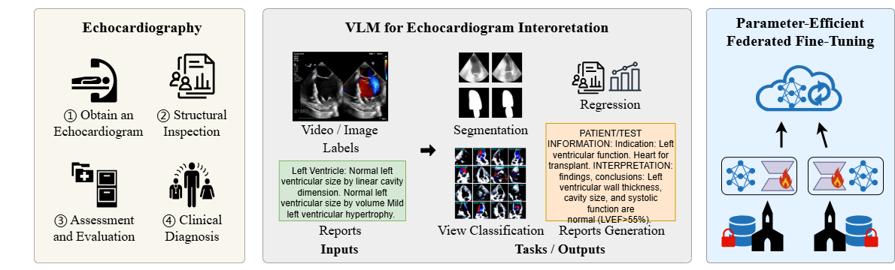
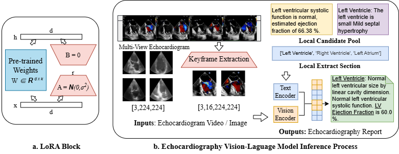
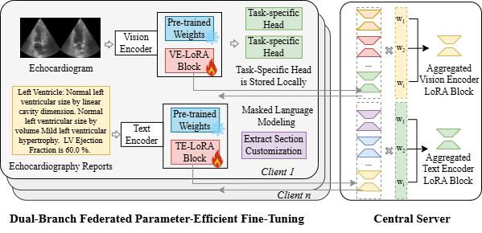

# FedEcho: Parameter-Efficient Customization of VLMs for Echocardiography Interpretation via Dual-Branch Federated Adapters

<p align="center">
  <a href="#"></a>
  <a href="#"></a>
</p>


This repository is the official implementation of [**FedEcho: Parameter-Efficient Customization of VLMs for Echocardiography Interpretation via Dual-Branch Federated Adapters**]. (Submitted to **MICCAI 2026**)



## Paper of our work

FedEcho: Parameter-Efficient Customization of VLMs for Echocardiography Interpretation via Dual-Branch Federated Adapters





## Baselines
Following the implementation of work FedGA, we here provide four baseline menthod implementations in ./algorithms/:
 - EchoPrime [https://www.nature.com/articles/s41586-025-09850-x]
 - EchoCLIP [https://www.nature.com/articles/s41591-024-02959-y]
 - PanEcho [https://www.cards-lab.org/panecho]


## Requirements

- Python 3.10.0
- numpy 1.26.4
- torch 2.2.0
- torchvision 0.17.0


To install requirements:
```
pip install -r requirements.txt
```

## Dataset

To implement datasets mentioned in the paper, first create directory for log files and change the dataset path (`pacs_path`,`officehome_path`, and `DomainNet`) and log path (`log_count_path`) in configs/default.py.
Please download the datasets from the official links:

- [EchoNet-Dynamic](https://echonet.github.io/dynamic/)
- [CAMUS](https://www.creatis.insa-lyon.fr/Challenge/camus/)
- [EchoNotes](https://physionet.org/content/echo-note-to-num/1.0.0/)


## Training from scratch

We release the code for PACS dataset and officehome dataset can be applied by only changing the dataloader_obj in data/{officehome, DomainNet}_dataset.py. 

Then running the code:

`
python ./FedLoRA_vision.py
python ./FedLoRA_text.py
`

## Acknowledgement

Part of our code is borrowed from the following repositories.

We thank to the authors for releasing their codes. Please also consider citing their works.
