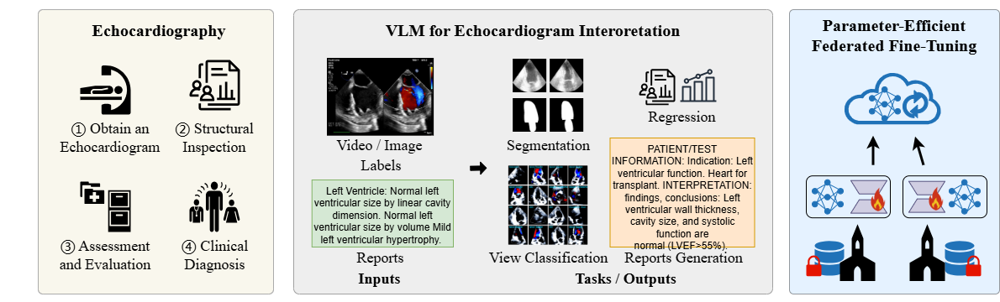
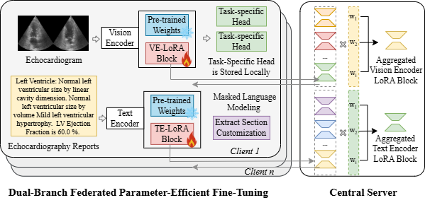
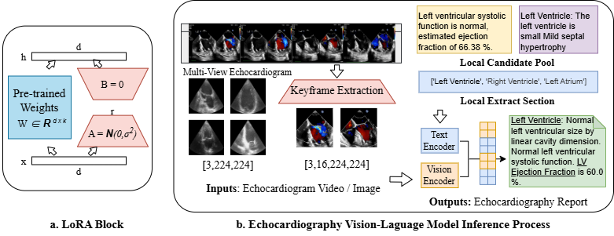

# FedEcho: Parameter-Efficient Customization of VLMs for Echocardiography Interpretation via Dual-Branch Federated Adapters

<p align="center">
  <a href="#"></a>
  <a href="#"></a>
  <a href="#"></a>
  <a href="#"></a>
</p>

<p align="center">
  <b>Official implementation</b> of <i>FedEcho: Parameter-Efficient Customization of VLMs for Echocardiography Interpretation via Dual-Branch Federated Adapters</i> (Submitted to MICCAI 2026)
</p>

<p align="center">
  
</p>

## Overview


<p align="center">
  
</p>

## Key Features

- **Dual-branch federated LoRA** — separate adapters for vision and text encoders, aggregated independently
- **Privacy-preserving** — only LoRA parameters are communicated; no raw data leaves the client
- **Candidate-pool-aware aggregation** — balances local data quantity and retrieval pool size


## Installation

```bash
git clone https://github.com/USERNAME/FedEcho.git
cd FedEcho
conda create -n fedecho python=3.10 -y
conda activate fedecho
pip install -r requirements.txt
```

### Dependencies

- Python >= 3.10
- PyTorch >= 2.2
- torchvision >= 0.17
- transformers >= 4.36
- peft >= 0.7
- pandas, numpy, tqdm, opencv-python, pydicom, scikit-learn

## Datasets

Please download the following datasets and update the paths in the command-line arguments:

| Dataset | Description | Link |
|---------|-------------|------|
| EchoNet-Dynamic | Echocardiography videos with EF labels | [Download](https://echonet.github.io/dynamic/) |
| CAMUS | Cardiac ultrasound segmentation benchmark | [Download](https://www.creatis.insa-lyon.fr/Challenge/camus/) |
| EchoNotes | Clinical echocardiography reports | [Download](https://physionet.org/content/echo-note-to-num/1.0.0/) |

### Pre-trained Weights

Download the EchoPrime pre-trained weights and place them under `model_data/weights/`:

```
model_data/weights/
├── echo_prime_encoder.pt
├── echo_prime_text_encoder.pt
└── view_classifier.pt
```

## Training

### 1. Vision Encoder (Federated LoRA)

Fine-tune the MViT-v2-S video encoder with EF regression on EchoNet-Dynamic:

```bash
python FedLoRA_vision.py \
    --video_root /path/to/EchoNet-Dynamic/Videos \
    --filelist_csv /path/to/EchoNet-Dynamic/FileList.csv \
    --num_clients 4 \
    --videos_per_client 500 \
    --global_rounds 10 \
    --local_epochs 1 \
    --batch_size 2 \
    --lr 1e-4 \
    --lora_r 8 \
    --candidate_pool_sizes "1000,800,1200,600"
```

### 2. Text Encoder (Federated LoRA + MLM)

Fine-tune the BiomedBERT text encoder with Masked Language Modeling on EchoNotes:

```bash
python FedLoRA_text.py \
    --data_dir /path/to/echonotes \
    --num_clients 4 \
    --reports_per_client 500 \
    --global_rounds 10 \
    --local_epochs 1 \
    --batch_size 8 \
    --lr 2e-5 \
    --mlm_probability 0.15 \
    --candidate_pool_sizes "500,500,500,500"
```

### 3. Build Candidate Pool

Encode EchoNote reports into the candidate pool for retrieval-based report generation:

```bash
python candidate_extract.py \
    --data_dir /path/to/echonotes \
    --text_encoder_ckpt model_data/weights/echo_prime_text_encoder.pt \
    --lora_dir federated_checkpoints/fedtextlora_YYYYMMDD_HHMMSS \
    --batch_size 32
```

## Inference

```python
import torch
import pickle
from echo_prime import EchoPrime

ep = EchoPrime()

# Load federated LoRA weights (vision)
lora_state = torch.load("federated_checkpoints/lora_echoprime_fedavg.pt")
ep.echo_encoder.load_state_dict(lora_state, strict=False)

# Load echonote candidate pool
ep.candidate_embeddings = torch.load("model_data/candidates_data/echonote_candidate_embeddings.pt")
with open("model_data/candidates_data/echonote_candidate_reports.pkl", "rb") as f:
    ep.candidate_reports = pickle.load(f)

# Process videos and generate report
stack_of_videos = ep.process_mp4s("/path/to/study_folder")
study_emb = ep.encode_study(stack_of_videos)
report = ep.generate_report_echonote(study_emb)
print(report)
```

<p align="center">
  
</p>


## Baselines

| Method | Reference |
|--------|-----------|
| EchoPrime | [Christensen et al., Nature 2025](https://www.nature.com/articles/s41586-025-09850-x) |
| EchoCLIP | [Christensen et al., Nature Medicine 2024](https://www.nature.com/articles/s41591-024-02959-y) |
| PanEcho | [Lovedev et al., 2025](https://www.cards-lab.org/panecho) |


## Acknowledgement

This project builds upon the following open-source works:

- [EchoPrime](https://github.com/echonet/echoprime) — Pre-trained echocardiography VLM


We thank the authors for releasing their code. Please also consider citing their works.

## License

This project is licensed under the MIT License. See [LICENSE](./LICENSE) for details.
